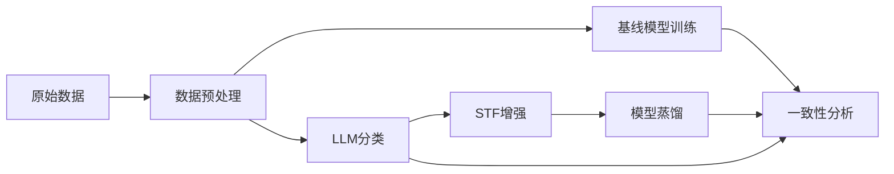

# 小程序隐私声明自动分类项目

> 对小程序隐私声明进行**必要性**和**清晰性**二维分类的实验性研究项目

## 项目概述

本项目旨在通过多种技术路线对小程序���私声明文本进行自动分类，并分析不同方法在分类性能、一致性和可落地性方面的差异。

### 分类维度

- **必要性 (Necessity)**: 数据收集是否必要
  - 0: 必要
  - 1: 不必要

- **清晰性 (Clarity)**: 声明是否清晰说明数据用途
  - 0: 清晰
  - 1: 模糊

### 技术路线

1. **传统预训练模型** - 基于中文RoBERTa的监督学习
2. **LLM提示词分类** - 使用大语言模型直接分类
3. **STF增强LLM** - 结构化思维框架增强的LLM分类
4. **模型蒸馏** - 将STF-LLM知识蒸馏到轻量级模型

## 项目结构

```
miniapp-declare-classification/
├── data/                      # 数据集
│   ├── raw/                   # 原始数据
│   ├── processed/             # 处理后数据
│   └── augmented/             # 增强数据
├── experiments/               # 实验代码
│   ├── baseline/              # 基线实验
│   ├── llm_prompting/         # LLM提示实验
│   ├── stf_enhanced/          # STF增强实验
│   └── distillation/          # 蒸馏实验
├── analysis/                  # 分析评估脚本
├── data_processing/           # 数据处理工具
├── configs/                   # 配置文件
├── prompts/                   # 提示词管理
│   ├── classification_prompt.md      # 统一分类提示词
│   ├── necessity_violation_prompt.md  # 必要性违规提示词
│   └── ambiguity_violation_prompt.md  # 表述模糊违规提示词
├── utils/                     # 工具模块
├── results/                   # 实验结果
│   ├── models/                # 训练模型
│   ├── predictions/           # 预测结果
│   └── logs/                  # 运行日志
└── docs/                      # 文档
```

## 快速开始

### 环境配置

```bash
# 创建虚拟环境
python -m venv venv
source venv/bin/activate  # Windows使用: venv\Scripts\activate

# 安装依赖
pip install -r requirements.txt
```

### 数据准备

数据已放置在 `data/raw/` 目录：
- `all_declares.jsonl` - 所有声明 (26,940条)
- `aggregate_datas_label.jsonl` - 已标注数据 (1,137条)

### 运行实验

#### 1. 训练RoBERTa基线模型

```bash
cd experiments/baseline
python train_roberta.py
```

#### 2. LLM提示词分类

项目提供三种 LLM 分类器：

```bash
cd experiments/llm_prompting

# 方式1: 统一分类器（同时评估两个维度）
python classify_unified.py

# 方式2: 必要性独立分类��
python classify_necessity.py

# 方式3: 表述模糊独立分类器
python classify_ambiguity.py

# 方式4: 运行所有分类器并对比（推荐）
python run_all_classifications.py
```

详细使用说明请参阅：[LLM 分类器使用指南](docs/LLM_CLASSIFICATION_GUIDE.md)

#### 3. 数据增强

```bash
cd data_processing
python augment_data.py
```

### 配置说明

主要配置文件位于 `configs/` 目录：

- `model_config.yaml` - 模型配置
- `training_config.yaml` - 训练参数
- `data_config.yaml` - 数据处理配置

## 实验流程



## 主要功能模块

### 数据处理 (`data_processing/`)

- **数据增强**: 通过语序重排、同义替换等方式生成训练数据
- **数据预处理**: 清洗、去重、分割数据集

### LLM API调用 (`utils/llm_api.py`)

统一的异步API调用接口，支持：
- 自动重试机制
- 并发控制
- 错误处理

### 评估指标 (`utils/metrics.py`)

- 准确率、精确率、召回率、F1分数
- 混淆矩阵
- 多模型一致性分析

## 依赖项

主要依赖包括：
- Python >= 3.8
- PyTorch >= 1.10
- Transformers >= 4.20
- DashScope (阿里云LLM API)
- scikit-learn
- pandas

完整列表见 `requirements.txt`

## 实验结果

实验结果保存在 `results/` 目录：
- 训练好的模型: `results/models/`
- 预测结果: `results/predictions/`
- 运行日志: `results/logs/`

## 贡献指南

欢迎提交Issue和Pull Request！

## 许可证

MIT License

## 文档索引

- [LLM 分类器使用指南](docs/LLM_CLASSIFICATION_GUIDE.md) - LLM 分类器详细使用说明
- [项目详细文档](docs/project_readme.md) - 研究背景与实验方法
- [AUTODL 使用指南](docs/AUTODL_GUIDE.md) - AutoDL 平台使用说明
- [依赖说明](docs/DEPENDENCIES.md) - 项目依赖详解
- [Bug 修复记录](docs/BUG_FIXES.md) - 已修复问题记录

## 联系方式

如有问题，请通过Issue联系我们。
